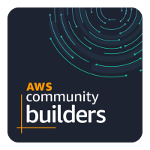

  

  <h3 align="center">Gopher Holes Unlimited</h3>

<!-- TABLE OF CONTENTS -->

  
Table of Contents

  <ol>
    <li>
      <a href="#about-the-project">About The Project</a>
      <ul>
        <li><a href="#built-with">Built With</a></li>
      </ul>
    </li>
  </ol>

<!-- ABOUT THE PROJECT -->
## About The Project
Welcome to Gopher Holes Unlimited! A new website that tracks two things: gophers and gopher holes.
We pride ourselves in our ability to provide current, up-to-date statistics on all gophers and their
associated holes in the United States.

#### Architecture Gopher Backend API diagram

### Built With
This project is built with technologiest as below.
* [Serverless Framework](https://www.serverless.com/)
* [NodeJS](https://nodejs.org/en/)
* [DynamoDB](https://aws.amazon.com/dynamodb/)
* [DynamoDB Single Table Design](https://www.youtube.com/watch?v=Q6-qWdsa8a4)
* [Cognito Presignup Triggers](https://docs.aws.amazon.com/cognito/latest/developerguide/user-pool-lambda-pre-sign-up.html)
* [AWS SDK V3](https://docs.aws.amazon.com/AWSJavaScriptSDK/v3/latest/index.html)
* [AWS Event Bridge](https://www.youtube.com/watch?v=28B4L1fnnGM)
* [AWS Lambda](https://aws.amazon.com/lambda/)
* [Cognito JWT token](https://docs.aws.amazon.com/cognito/latest/developerguide/amazon-cognito-user-pools-using-tokens-with-identity-providers.html)
* [AWS SNS](https://aws.amazon.com/sns/)
* [AWS SQS](https://aws.amazon.com/sqs/)
* [Github Action](https://github.com/features/actions)
* [Lambda log](https://lambdalog.js.org/)